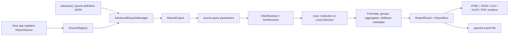

# Laravel Report Builder: Source-Grounded Guide

> **Scope and status.** This guide describes the code in this package, not its aspirational README/API. “Implemented” means there is an execution-path call site; “partial” means code exists but the path or result is incomplete; “unimplemented” means a DTO/config/model exists without an execution path. Observations are based on `src/`, routes, migrations, views, and tests in this package.

## What it is

`elgibor-solution/laravel-report-builder` is a Laravel 10–13, PHP 8.2+ package for storing a JSON report definition, executing a developer-approved source query, applying query filters/sorts and PHP-side transformations, recording runs, and rendering data as HTML, JSON, CSV, XLSX, or PDF.

Its intended trust boundary is a **registered `ReportSourceContract`**: definitions reference a source key, never raw table names or SQL. Sources supply the actual query and exposed field metadata. The package also has a bridge for `ESolution\DataSources\Models\DataSource` that creates runtime sources named `dynamic:{id}`.



## Capability status at a glance

| Capability | Status | Actual behavior / important qualification |
|---|---|---|
| Registered static sources | Implemented | Host application registers an instance or class through the facade/manager. There is no automatic class discovery. |
| Source schema/designer schema | Implemented | Exposes visible fields, source parameters, global filter catalog, and UI-oriented type suggestions. |
| Dynamic Data Source bridge | Partial | Connects and persists `DataSource` adapters, but assumes that external package exists, interpolates custom SQL unsafely, and disconnect does not unregister for the current process. |
| Persisted report CRUD | Implemented, weakly protected | CRUD routes exist; create has no policy check and does not validate definition/source before saving. |
| Parameters | Partial | Definition parameters get defaults/token resolution/coercion. Source-declared parameters are exposed in schema but are not merged into/validated as definition parameters. |
| Query filters and sorts | Implemented with constraints | Applied to source builder via `selectExpr` or field key. SQL projection is **not** derived from columns. |
| Groups and overall aggregates | Partial | Performed in PHP after fetch; group metadata and global aggregates work, but per-group aggregate method is never called. |
| Formulas | Partial/broken integration | Row evaluation works, but validator only permits source fields in columns/sorts/groups/aggregates, so formulas cannot be selected, sorted, grouped, or aggregated as claimed. |
| Drilldowns | Partial/broken HTML | Metadata is attached, but it is parameter-level rather than row-level; the shipped Blade template looks up the metadata at the wrong nesting level, so links do not render. |
| Subreports | Unimplemented in main flow | `SubreportResolver::execute()` exists but `ReportEngine` never injects/calls it. |
| Conditional formatting | HTML-only partial | JSON preserves rules. HTML supports only six comparison operators and emits definition-controlled CSS verbatim. |
| Preview | Broken/partial | It creates run records; the alleged 50-row limit is placed in `definition.meta` but query engine ignores it. Inline preview uses an unsaved report and normally cannot create its required run row. |
| Run history/snapshots | Implemented with caveats | Every engine run persists history; optional snapshots cap rows at 1,000 but eager-consume lazy streams. No run/snapshot API for snapshots. |
| Sync rendering/export | Implemented | HTML string, JSON array, CSV streamed response; PDF/XLSX need optional packages. |
| Queued export | Partial | Persists file and status, but runs the report twice, never associates `report_run_id`, drops initiating user identity, and ignores requested filename. |
| Schedules | Data-model only | Migration/model and `markRan()` exist; no scheduler command, route, dispatcher, or delivery implementation. |
| Tenant scope / field ACL | Partial/unwired | Models use a simple global scope, but configured resolver is ignored by it; `TenantScope` and field checker are not applied. |

## Installation and host integration

Composer auto-discovery loads `AdvancedReportsServiceProvider`. It merges `advanced-reports`, loads migrations and views, binds core services, registers a `Report` policy, conditionally loads routes, and attempts to boot persisted dynamic sources. That boot attempt catches **all** throwables silently, so a missing bridge table or missing `laravel-data-sources` dependency does not stop boot but is hard to diagnose.

The package publishes config, migrations, and views. Its console commands are:

| Command | Behavior |
|---|---|
| `php artisan advanced-reports:install` | Publishes config/migrations/views and interactively invokes `migrate`. |
| `php artisan make:report-source Name` | Generates a source class in `App\Reports\Sources`; registration is still manual. |
| `php artisan advanced-reports:cleanup-runs [--days=] [--dry-run]` | Deletes old runs and old export files/records; it is not scheduled automatically. |

Register sources in a host service provider, typically its `boot()` method:

```php
use ElgiborSolution\AdvancedReports\Facades\AdvancedReports;
use App\Reports\Sources\SalesOrderSource;

AdvancedReports::registerSource(SalesOrderSource::class);
// Or register an already-constructed ReportSourceContract with an override key:
AdvancedReports::registerSource($source, 'sales_orders');
```

`SourceRegistry` resolves a class through Laravel’s container immediately (despite its “deferred” comment), gets `key()`, and stores the resolved object for the process lifetime. `flush()` is available, but there is no single-source unregister operation.

### Defining a static source

Extend `Sources\ReportSource` or implement `Contracts\ReportSourceContract`. A source must implement `key()`, `label()`, and `query(array $parameters): Illuminate\Contracts\Database\Query\Builder`; `description()`, `defineFields()`, and `defineParameters()` have defaults.

```php
final class SalesOrderSource extends ReportSource
{
    public function key(): string { return 'sales_orders'; }
    public function label(): string { return 'Sales orders'; }
    public function description(): string { return 'Orders visible to the current tenant.'; }

    protected function defineFields(): array
    {
        return [
            $this->field('number', 'Order number'),
            $this->field('amount', 'Amount', 'decimal', aggregatable: true),
            $this->field('state', 'State'),
            // map a public field key to a developer-controlled SQL expression
            $this->field('created', 'Created', 'date', selectExpr: 'orders.created_at'),
            $this->field('internal_cost', 'Internal cost', 'decimal', hidden: true),
        ];
    }

    public function query(array $parameters = []): \Illuminate\Database\Eloquent\Builder
    {
        // Source owns joins, authorization/tenant restrictions, and projection.
        return \App\Models\Order::query()->select('number', 'amount', 'state', 'created_at');
    }
}
```

`ReportField` supports `key`, `label`, `type`, `sortable`, `filterable`, `aggregatable`, `hidden`, `selectExpr`, `format`, and `description`. `selectExpr` is deliberately source-owned and used for filtering/sorting. Hidden fields cannot be display columns but may be filters, sorts, groups, and aggregates. `ReportParameter` supports `name`, `type`, `required`, `default`, `allowedValues`, and `description`.

**Projection warning:** `QueryBuilderEngine::resolveColumns()` only returns display metadata. It does **not** call `select()` or add fields needed for formulas/aggregates. The source query must select all fields later read by `data_get()`.

## Report creation and definition

A `Report` stores top-level `name`, unique `code`, `data_source`, optional JSON `definition`, visibility/activity flags, creator, and optional tenant. At execution, `AdvancedReportsManager::run()` uses **`definition.data_source`**, not the model’s `data_source`. The create/update requests permit these to diverge and do not require a definition, so a report may save successfully but be unrunnable.

The immutable `Definitions\ReportDefinition` accepts snake or camel case for `data_source`/`dataSource` and `conditional_formatting`/`conditionalFormatting`:

```json
{
  "name": "Completed sales",
  "data_source": "sales_orders",
  "parameters": [
    {"name": "state", "type": "string", "default": "completed", "required": true}
  ],
  "columns": [
    {"field": "number", "label": "Order #"},
    {"field": "amount", "label": "Amount", "format": "currency"}
  ],
  "filters": [{"field": "state", "operator": "=", "value": "{{param.state}}"}],
  "sorts": [{"field": "amount", "direction": "desc"}],
  "groups": [{"field": "state", "label": "State"}],
  "aggregates": [{"field": "amount", "function": "sum", "label": "Total amount"}],
  "formulas": [{"name": "tax", "expression": "amount * 0.07", "type": "decimal"}],
  "drilldowns": [{"trigger": "number", "type": "route", "target": "orders.show", "parameters": {"order": "{{row.id}}"}}],
  "subreports": [],
  "conditional_formatting": [{"field": "amount", "operator": ">", "value": 1000, "style": {"color": "red"}}],
  "layout": {"orientation": "landscape"},
  "meta": {}
}
```

The validator runs only during `AdvancedReportsManager::run()`, not report creation/update or preview. It checks name, source registration, definition parameters, visible columns, filterable fields and global operators, groups, aggregatable fields/functions, sortable fields/direction, formula syntax, and that a drilldown has target/type (`report`, `route`, or `url`). It does not validate `subreports`, conditional-format rules, layout/meta, filter value shapes, field type/operator compatibility, or source query semantics.

### Parameters, filters, sorting, grouping, aggregates

| Section | Runtime behavior |
|---|---|
| `parameters` | `ParameterResolver` loops only definition entries. It chooses supplied value, then default, substitutes `{{param.x}}` using the *provided* array, and coerces `integer`, `decimal`, `boolean`, `date`, `datetime` (Carbon), or `array`. Unknown supplied parameters disappear. |
| `filters` | `FilterResolver` calls source query, then converts field to `selectExpr ?? field` and applies `where*`. Supported actual tokens are `=`, `==`, `!=`, `<>`, comparisons, `like`, `not like`, `ilike`, `in`, `not in`, `between`, `not between`, `is null`, `is not null`, `date`, `month`, and `year`. `between` silently fills missing endpoints with null. |
| `sorts` | Calls `orderBy(selectExpr ?? field, asc|desc)` before fetch. |
| `groups` | Fetches all/streamed rows, PHP sorts by group values and returns a map of distinct values by field. Rows are not nested and only the first group is nominally considered by the Blade view. |
| `aggregates` | Runs after formulas on PHP rows; `sum`, `avg`, `min`, `max`, `count`; nulls are excluded. Keys are labels (duplicate labels overwrite). `perGroup()` exists but no call site. |

The designer schema’s `FieldTypeOperatorMap` still advertises symbolic filter aliases such as `contains`, `equals`, and `greater_than`, whereas execution validation accepts the `Operators` SQL-style catalog above. Aggregate suggestions are field-keyed: `count` is available for every visible field, while `sum`, `avg`, `min`, and `max` require an aggregatable numeric field. The validator enforces the same capability/type rule.

### Summary rows (subtotal / grand total output)

Each aggregate owns its presentation in `aggregates[].output`. These settings apply wherever that aggregate's result appears: every group subtotal and the grand total. Grouping only decides the calculation scope, and output settings never change how values are calculated. Each `aggregate_cells` entry carries `index`, the aggregate's position in `definition.aggregates`.

`Support\SummaryRowLayout` resolves placement for HTML/PDF, XLSX and CSV. `report-summary-layout.ts` in the Angular designer mirrors it. In the designer, the settings are under **Grouping → Aggregates → Output** for each entry. All settings are optional:

```json
{ "field": "total_amount", "function": "sum", "label": "Total",
  "output": {
    "column": "@last",
    "align": "right",
    "format": "currency",
    "style": { "bold": true, "text_color": "#92400e", "background_color": "#fef3c7",
               "border_style": "double", "border_position": "top", "border_color": "#1f2937" },
    "label": { "show": true, "text": "Total", "column": "order_number", "colspan": 2, "align": "center" }
  } }
```

- **Values:** a value goes to `output.column`. That can be a field or `"@last"`, which means the rightmost displayed column and follows column reordering. If the target is unset, removed or not displayed, the value goes to its own field. Values that share a column are joined as `Label: value | …` and use the first aggregate's style.
- **Format:** if `format` is empty, it comes from the source field: `count` is always whole, and the average of an integer field keeps its decimals.
- **Labels:** labels are placed in aggregate order. Each goes in its own `label.column` if that column is free, otherwise in the first free column. A span grows only across columns without a value or another label, and stops at the last column. The resulting cells cover every column once, so they never overlap. Labels that find no free column are shown on their own row. If the label text is empty, the row name is shown instead: `Subtotal` or `Grand total`.
- **Styles:** settings are sanitized. Colors must be hex values, and the other options must be in their allowed lists. `SummaryRowLayout::validationErrors()` reports invalid shapes through `ReportDefinitionValidator` and the store/update requests. Unknown column references are not errors, because they fall back as described above.
- **Migration:** aggregates without `output` take their settings from the earlier `layout.summary.{subtotal,grand_total}` and `aggregates[].summary_columns`. The row label moves to the first aggregate, and the subtotal settings win over the grand-total ones. With no settings at all, reports render as before. The designer writes the migrated shape the next time the report is saved.
- **Output:** XLSX merges spanned label cells and maps font, fill, alignment, borders and number formats. CSV has no merges: the label is written to the first column of its span, and the other spanned columns stay empty.
- **Persistence:** the store/update requests declare `definition.layout` without nested rules, because Laravel's `validated()` drops any nested keys that have no rule. `definition.aggregates` is kept whole, so `output` persists.

### Formulas and calculated fields

`SafeExpressionEvaluator` wraps Symfony ExpressionLanguage (no PHP `eval`), normalizes dotted **top-level keys** from `customer.name` to `customer_name`, and exposes `now`, `date`, `round`, `abs`, `int`, `float`, `string`, `sum`, `avg`, `min`, and `max`. It evaluates each formula in definition order against the row; errors are swallowed and assign `null`.

Formula syntax is validated against source field names plus formula names. But current integration prevents definitions from treating a formula name as a normal field: column/sort/group/aggregate validators require `source->fields()->has(field)`. Renderers only generate headers from declared columns. Therefore formulas can be calculated and appear in raw rows/JSON row objects, but cannot be reliably surfaced as report columns or aggregated/sorted/grouped through a valid definition.

### Drilldowns, subreports, conditional formatting

- **Drilldowns:** `DrilldownResolver::resolveForParameters()` puts an `_meta` URL on each definition using resolved report parameters, but never invokes its own `resolveForRow()`. `{{row.x}}` therefore cannot be resolved by the engine. `report` URLs target `.../reports/{code}/run?parameters[...]`; `route` uses Laravel `route()`; `url` replaces `{parameter}` placeholders.
- **HTML drilldown defect:** `HtmlRenderer` maps a trigger to its `_meta`, then `html.blade.php` asks for `$dd['_meta']['url']`, one level too deep. Links resolve to plain text. Even if fixed, the map is one URL per column, not per row.
- **Subreports:** `SubreportResolver` can resolve `{{row.*}}`/`{{param.*}}`, find a report code and run it with a maximum argument depth of three, but no path calls `execute()` and the container depth binding is never read. `definition.subreports` only round-trips.
- **Conditional formatting:** `HtmlRenderer` groups rules by field and Blade applies the first matching `>`, `>=`, `<`, `<=`, `=`, or `!=` rule. CSV/XLSX/PDF do not apply it (PDF inherits HTML output), JSON returns rules only. The CSS string is emitted as raw HTML; report-definition writers can inject CSS/attributes.

## Execution, rendering, and export flow

```mermaid
sequenceDiagram
  participant Client
  participant Manager as AdvancedReportsManager
  participant Engine as ReportEngine
  participant Source as Registered source
  participant DB as package tables
  Client->>Manager: run/report render/export
  Manager->>Manager: resolve model, authorize view/export, validate definition
  Manager->>Engine: run
  Engine->>DB: create pending ReportRun; mark running
  Engine->>Source: query(resolved parameters)
  Engine->>Engine: filters, sorts, fetch, normalize, formulas, grouping, aggregates
  Engine->>DB: mark completed/failed; optional snapshot
  Engine-->>Manager: ReportResult
  Manager->>Engine: selected renderer
  Engine-->>Client: response/string/array
```

`ReportEngine` persists `ReportRun` before query work, emits `ReportRunning`, then `ReportCompleted` or `ReportFailed`. It uses a `LazyCollection` with `cursor()` by default, or `get()` when configured otherwise. It applies `performance.row_limit` only to fetch and clones the built query for count. Note that PHP grouping/aggregates/renderers often consume the lazy iterator, so the “lazy” configuration does not guarantee low memory.

| Format | Renderer return | Notes |
|---|---|---|
| HTML | rendered string | Blade table formats declared columns; formula values only format if a formula name is already in a row/column. |
| JSON | PHP array | API run endpoint wraps it in JSON; includes formatted rows and metadata. |
| CSV | `StreamedResponse` | Header contains only declared columns but formula cells are appended without formula headers: malformed column counts. |
| XLSX | Laravel Excel download response | Requires `maatwebsite/excel` (and PhpSpreadsheet classes). Imports these types eagerly, so absence can fail at class loading before the intended dependency check. “Groups as sheets” is not implemented. Aggregate footer fields are keyed by labels that do not match headings. |
| PDF | download response or Browsershot binary | DomPDF requires `barryvdh/laravel-dompdf`; Browsershot needs its package; custom expects first callable tagged `advanced-reports.pdf.engine`. PDF renderer produces HTML view, not the advertised separate PDF Blade view. |

Synchronous export calls `run()` once then renders that result. Direct `render()` similarly performs one run. The web download route calls synchronous `export()`; it defaults to PDF.

### Queued export

`queueExport()` creates a pending `ReportExport`, pushes `ExportReportJob` onto the configured connection/queue, and returns it. The job marks it processing, calls `manager->run()` into an unused `$result`, then calls `manager->render()` which runs again. It captures streamed/binary/standard response content and writes it to configured storage, then marks completed and fires export events.

Consequences: two report runs and events per successful job; export’s `report_run_id` remains null; no `filename` option is passed to filename builder; queue job does not restore the initiating user, which can deny private reports or record an unauthenticated run. The default `disk`, `path`, and queue settings are used; API request validation does not accept disk/path/queue overrides.

## Persistence, events, cleanup

| Table / model | Stored data and current use |
|---|---|
| `advanced_reports` / `Report` | Definitions, source key, creator, public/active, tenant; soft-deleted. |
| `advanced_report_runs` / `ReportRun` | Parameters, status, row count, aggregate summary, timestamps/error. Created on every engine run. |
| `advanced_report_exports` / `ReportExport` | Queue state/file metadata/options. Sync exports do not create an export record. |
| `advanced_report_snapshots` / `ReportSnapshot` | Optional snapshot of columns, aggregates, and up to 1,000 rows. No API/model retrieval feature beyond relation. |
| `advanced_report_schedules` / `ReportSchedule` | Cron metadata/recipients only; no executor. |
| `advanced_report_permissions` / `ReportPermission` | User/role grants (`view`, `edit`, `run`, `export`, `delete`). No management endpoint/UI. |
| `advanced_report_connected_sources` / `ConnectedSource` | Data Source bridge persistence. No FK to external `data_sources`. |

Events: `ReportRunning`, `ReportCompleted`, `ReportFailed`, `ReportExportStarted`, `ReportExportCompleted`, and `ReportExportFailed` are dispatched. The cleanup command deletes old run records using `history.cleanup.keep_days`; it independently deletes expired export files/records using `export.retention_days`. It must be registered by the host scheduler; config `history.cleanup.enabled` is not checked by the command.

## HTTP API

The default API prefix is `/api/advanced-reports` with only the configured `['api']` middleware; the package does not add `auth`, `can`, or rate-limit middleware. `{report}`, `{run}`, and `{export}` use Eloquent route model binding through UUID because package models implement `getRouteKeyName()` in `HasUuid`.

| Method and path | Actual action |
|---|---|
| `GET sources` | Lists registered source summaries; no authorization. |
| `GET sources/dynamic`, `GET sources/available` | Lists connected or external DataSources; no authorization. |
| `POST sources/connect`, `DELETE sources/{key}/disconnect` | Creates/removes bridge record; no policy/tenant check. |
| `GET sources/{source}/schema`, `designer-schema` | Field/parameter schema, no authorization. |
| `POST sources/{source}/formula/validate` | Validates expression syntax against source fields. |
| `GET/POST reports`, `GET/PUT/PATCH/DELETE reports/{report}` | CRUD. Index scopes active and `forUser`; store has no gate check or definition validation. Show/update/delete use view/edit/delete policy. Resources omit the definition entirely. |
| `POST reports/preview-inline`, `POST reports/{report}/preview` | Direct engine call rather than manager; bypasses policy and validator and has the preview defects described above. |
| `GET reports/{report}/runs`, `POST reports/{report}/run`, `GET runs/{run}` | History/run. Manager authorizes `view`; it never requests the `run` policy ability. |
| `POST reports/{report}/export`, `GET exports/{export}`, `GET exports/{export}/download` | Sync/queued export and polling/download. Export uses `export` policy; show/download use `view`. |

The optional web routes use configured `web` middleware: `GET reports/{report}/preview` calls manager render (therefore `view` policy) and `GET reports/{report}/download` calls manager export. The route `report` segment binds UUID, although generated report drilldown URLs use the report **code**, so report drilldowns do not match default route binding.

## Security, authorization, and tenancy

`ReportPolicy` allows public reports, creators, or explicit `ReportPermission` records; role IDs are taken from a Spatie-like relation or `roles`/`role_ids`. `run` and `export` effectively accept a matching `view` grant too. `AdvancedReportsManager` applies permissions only when `security.enforce_permissions` is true, using `Gate::forUser($user)`.

There are significant integration requirements/limitations:

- Registration is a useful source-level trust boundary, but dynamic custom query source SQL uses naive `str_replace(':name', quoted value)`, not bound parameters. Do not allow untrusted people to create/edit external DataSource custom SQL.
- `FieldPermissionChecker` always returns no restricted fields and is never used by engine/renderers. Hidden source metadata is the only actual field-display guard.
- `BelongsToTenant` adds a global scope only if enabled and a container binding `advanced-reports.tenant` exists. It ignores configured `tenant_resolver` and authenticated user fallback. `Security\TenantScope` implements those fallbacks but is never attached to any model. Nothing automatically assigns `tenant_id` when creating reports; caller/controller must provide it (request accepts all guarded fields), and source queries themselves are not tenant-scoped by the package.
- The connected-source model does not use `BelongsToTenant`, so bridge connections are never tenant-scoped. `DataSourceBridge::bootConnected()` registers all persisted connections visible to its connection.
- API create, source administration/schema, and preview endpoints are unprotected under default middleware. Hosts should provide authentication/authorization middleware and restrict these routes before exposing them.

## Configuration and extension points

`config/advanced-reports.php` controls database connection, renderer class map, PDF driver/options, export storage/queue, fetch/cache/history settings, routes, and a designer flag. The `database.table_prefix`, `security.require_source_registration`, `performance.max_rows_sync`, `performance.cache.*`, `export.chunk_size`, `history.cleanup.enabled`, and `designer.enabled` settings have no active call site. `formats` is not in the published default config but is read by `Formatter`; hosts may add it for custom format callbacks.

Supported extension seams:

- Implement `ReportSourceContract` / extend `ReportSource`, then register it.
- Bind `Contracts\ExpressionEvaluator` to replace formula evaluation.
- Replace any `renderers.{format}` class with a container-resolvable `Contracts\ReportRenderer` implementation.
- Add formatter callbacks under `advanced-reports.formats`.
- Set `pdf.driver=custom` and tag a callable `advanced-reports.pdf.engine`.
- Listen to report/export events.
- Use `DataSourceBridge` only when the external Data Sources package/model is installed and compatible.
- Publish views/config/migrations; use the facade (`AdvancedReports`) or inject `AdvancedReportsManager` / `ReportEngine`.

## Important classes

| File | Responsibility |
|---|---|
| `src/AdvancedReportsServiceProvider.php` | Container bindings, publishing, policy/routes, bridge boot. |
| `src/AdvancedReportsManager.php` | Public façade service: resolve, manager-level authorization/validation, run/render/export. |
| `src/Definitions/ReportDefinition.php` / `ReportDefinitionValidator.php` | JSON DTO / source-aware validation. |
| `src/Sources/ReportSource.php`, `ReportField.php`, `ReportParameter.php`, `SourceRegistry.php` | Static source contract, metadata, process registry. |
| `src/Engine/ReportEngine.php` / `QueryBuilderEngine.php` | Run lifecycle / query fetch. |
| `src/Engine/*Resolver.php` | Parameter, filter, sort, grouping, aggregates, formulas, drilldown; subreport resolver is presently unused. |
| `src/Renderers/*Renderer.php` | Output-specific conversion. |
| `src/Export/ExportManager.php`, `Jobs/ExportReportJob.php` | Sync renderer dispatch / persisted asynchronous files. |
| `src/Bridge/*` | External Data Source adapter and connection persistence. |
| `src/Http/Controllers/*` | Public CRUD, source/schema, preview, run, export endpoints. |
| `src/Security/*` | Report policy; incomplete field/tenant mechanisms. |

## Known defects, inconsistencies, and dead/unreachable code

The following are observed source facts, not recommendations to change behavior:

1. `SubreportResolver`, `AggregateResolver::perGroup`, `TenantScope`, and `FieldPermissionChecker` have no execution-path invocation. Schedules have no executor.
2. Preview’s `meta.row_limit` is never read; it can fetch/report more than 50 rows. Inline preview cannot normally insert `ReportRun` because its temporary `Report` has no `id` and migration makes `report_id` non-null/foreign-key constrained. Preview also lacks manager authorization/definition validation.
3. Formula declarations are forbidden as columns/sorts/groups/aggregates by validation despite formula resolver documentation claiming those uses. Formula-output headers are not appended by renderers.
4. HTML drilldowns are structurally broken; row tokens are not resolved in the main flow. Generated report drilldown uses a code where default routes bind UUID.
5. Group metadata is not rendered as group headers/footers despite comments; the template creates unused group variables. Per-group aggregates are never calculated.
6. Dynamic Data Source custom-query parameter substitution is string interpolation, is SQL-injection-prone for untrusted values, does not bind null/array/date safely, and only handles parameters actually supplied/resolved to adapter. Dynamic connections are live until process restart after disconnect because registry has no unregister.
7. Queued export executes twice, leaves `report_run_id` null, ignores requested queued filename, and loses caller identity. Its unused first result makes the duplicate work explicit.
8. The API default is broad: creation, dynamic-source management, previews, schema exposure are not policy-gated; run uses `view` rather than `run`. `StoreReportRequest::authorize()` always returns true.
9. Tenant behavior is incomplete: no automatic tenant assignment; trait ignores resolver/user fallback; `TenantScope` is dead; reports can be created with caller-provided guarded `tenant_id`; source query data is never tenant-filtered by package code.
10. `ReportResource` intentionally omits `definition`, so CRUD show response cannot directly edit a report definition without another source. Request rules omit some supported fields (`parameters`, `subreports`, `conditional_formatting`, layout/meta) but Laravel’s parent `definition` array rule may still allow nested keys in validated data depending on framework behavior; the shape is not explicitly validated.
11. Source parameters and source `defineParameters()` are schema metadata only unless duplicated in definition parameters. `ReportDefinitionValidator` and `ParameterResolver` never consult `source->parameters()`.
12. The designer’s symbolic filter-operator list conflicts with the execution operator tokens; text operators and UI formats such as uppercase/relative are advertised but not implemented by the resolver/formatter. Aggregate suggestions and validation are aligned to the supported `count`, `sum`, `avg`, `min`, and `max` functions.
13. `PdfRenderer` renders `html.blade.php`; the published `pdf.blade.php` extends a document that has no `@yield('styles')`, so its PDF-only section is ineffective.
14. HTML conditional formatting emits raw CSS/attribute text from report definition and should be considered trusted-author input only. It does not apply to CSV/XLSX; JSON is metadata only.
15. `BaseModel` honors the configured connection but ignores configured `table_prefix`; model table names are hardcoded. Cache, `max_rows_sync`, export chunk size, required-source-registration toggle, cleanup-enabled toggle, and designer-enabled toggle are inert configuration.

## Practical end-to-end checklist

1. Publish/migrate the package and set route middleware, permissions, and tenant binding in the host.
2. Create a trusted static source whose `query()` enforces host authorization/tenant restrictions and selects every field later used.
3. Register the source during boot and verify `GET sources/{key}/schema` under protected middleware.
4. Save a report whose model `data_source` and definition `data_source` agree; validate the definition in host code before saving if early feedback is needed.
5. Execute with `AdvancedReports::run()`/`render()` or protected API; inspect `advanced_report_runs` for status/summary.
6. Use HTML/JSON/CSV directly; install optional PDF/XLSX dependencies before requesting those formats. Use queued export only with a running worker and awareness of its current double-run/identity behavior.
7. Treat subreports, schedules, per-group aggregates, strict previews, formula columns, field ACL, and robust tenancy as unavailable until their call paths are implemented.
